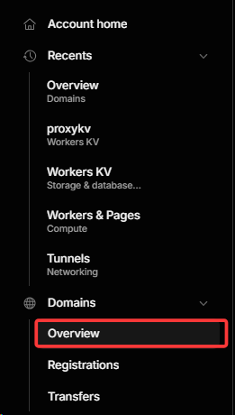
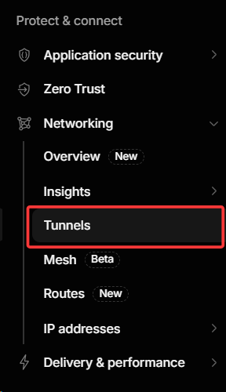
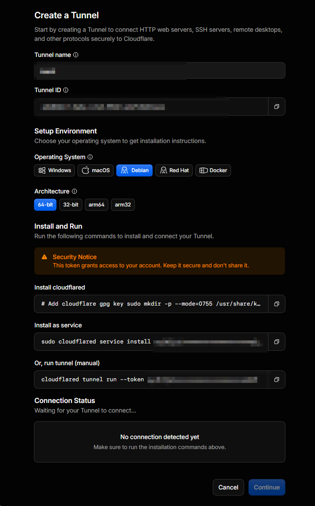
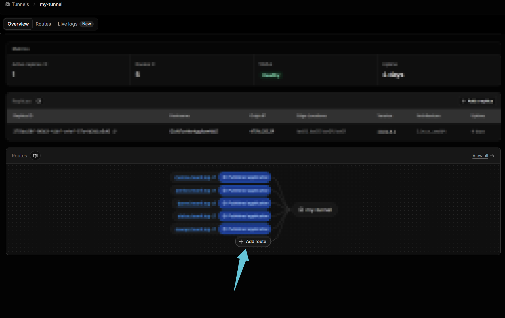
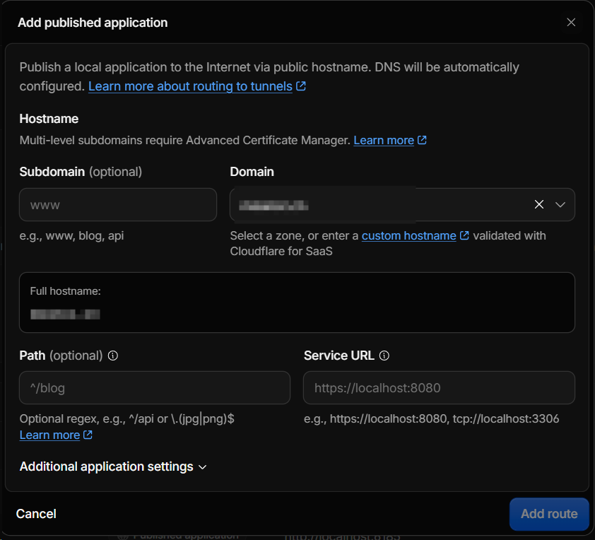

## 简要介绍

`Cloudflare` (赛博菩萨) 的免费版是互联网上少见的 **真免费** : 不限带宽, 不限量的 DDoS 防护, 自动签发续期的证书, 都不用付钱. 谁他妈能不爱兄弟

它的本质是一层**反向代理**。把域名的解析权交给它之后, 用户访问你的站点时, 流量会先到 Cloudflare 的机房, 再由它决定是直接返回缓存的内容, 还是转发给你的源站。后面要讲的所有东西——DNS 解析、CDN 加速、攻击防护、Tunnel 内网穿透——全都建立在「流量先经过它」这一件事上。

> [!TIP]
> 简单注册个账号就可以爽吃了也可以用第三方登录 比如`Github`和`Google`登录
> 跳转到Dashboard [Cloudflare Dashboard | Manage Your Account](https://dash.cloudflare.com/sign-up)

免费套餐不限制添加的域名数量, 个人用基本加不满。

## 添加自己的域名并配置DNS解析

登录之后, 控制台左侧的 **Domains** 分组就是入口, 展开后点 **Overview**：

进去点添加域名, 填上你自己的域名, 套餐选 **Free**。这时候 Cloudflare 会给你两个 NS（名称服务器）地址, 你要拿着它们去域名注册商那边, 把域名的 NS 换成这两个。

> [!NOTE]
> 添加域名配置解析后 我们的 Cloudflare 才能识别

换 NS 是这一步唯一有等待感的地方, 生效时间从几分钟到几小时不等。在它生效之前, Cloudflare 只是「知道你有个域名」, 还没有真正接管解析, 这时候做的任何配置都不会起作用。所以如果配置完半天没反应, 先去确认 NS 是否已经生效, 别急着怀疑自己配错了。

解析生效之后, 在 **DNS → Records** 里就能看到 Cloudflare 自动导入的记录。这里有个必须搞清楚的开关, 就是每条记录右边那朵云的颜色：

- **橘色云（Proxied）**：用户拿到的是 Cloudflare 的 IP, 你的真实源站被藏在后面, CDN 缓存和各类防护都在这一层生效;
- **灰色云（DNS only）**：Cloudflare 只当解析器, 把你的源站 IP 直接告诉用户, 缓存和防护全部不生效。

一句话——**只有橘色云的记录才有防护**。不少人以为挂上 Cloudflare 就安全了, 结果记录是灰的, 等于什么都没做。

另外代理只覆盖一组固定的 HTTP/HTTPS 端口（80、443、8080、8443 这些）, 服务跑在非标准端口上, 流量就会绕过 Cloudflare 直接打到源站。

## CloudFlare Tunnel

买了域名和某云服务器的小伙伴们, 最难受的应该就是**域名备案**问题了, 国内云厂商对 80 和 443 这两个端口管得最严：域名没有备案号, 解析过去会在厂商那一层就被拦下, 你连自己的服务都摸不到. 如果没有进行域名和服务器的备案, 直接访问域名将会跳转到厂商服务器的提示页面, 无法进行合法访问, 包括我们常见的**内网穿透**工具, 能够穿透的端口也小的可怜, 还要付费解锁更多端口, 这里不点名某 `frp` 软件

Tunnel 换了一个思路：**不需要你开放任何入站端口**。

在内网服务器上装一个 `cloudflared`, 由它主动向 Cloudflare 建立一条长连接。公网用户访问你的域名时, 流量从 Cloudflare 顺着这条已经建好的连接回到你的内网服务。从外面看, 你的服务就是 Cloudflare 上的一个普通域名, 而你的服务器只是「打了个电话出去」。

### 1. 创建隧道

进入 Cloudflare Dashboard 控制台, 左侧 **Networking → Tunnels**, 这就是隧道列表：

点创建之后, 先给隧道起个名字（建议直接用域名或服务名, 后面好认）, 接着是这台机器要跑的环境：

选系统和架构的时候**一定别选错**——我这里是 `debian x64` 的云服务器系统, 所以选 Debian + 64-bit。要是容器环境就选 Docker, ARM 机器就选 arm64, 以自己的实际情况为准.

1. 下载 `cloudflared`
2. 安装 tunnel 服务
3. 运行服务

> [!CAUTION]
> token 等同于你账号在这条隧道上的凭据, 页面上也专门用 Security Notice 提示了这一点。别截图往外发, 更不要提交到 Git 仓库里。

页面底部的 **Connection Status** 会一直显示「No connection detected yet」, 直到你的服务器真的连上来。**等它变成已连接再点 Continue**, 否则这条隧道在后面添加路由时会用不了。

### 2. 添加路由

隧道通了之后回到隧道详情页, 顶部有 Overview / Routes / Live logs 几个标签, 路由都在 **Routes** 面板里：

点 **+ Add route** 会弹出配置窗口：

窗口里的每一项都值得说清楚：

- **Subdomain**：这里可以自定义你的二级域名, 比如填 `blog` 或 `nas`, 最终就是 `blog.你的域名`; 留空则直接用主域名。
- **Domain**：选你刚托管过来的那个域名, 窗口里的 **Full hostname** 会实时显示最终域名。
- **Path**：可选, 只有想把某个路径单独指出去时才需要填。
- **Service URL**：最关键的一项, 填你**本地**服务实际监听的地址, 比如 `http://localhost:8080`、`tcp://localhost:3306`。

配置好之后 Cloudflare 会自动帮你把对应的 DNS 记录加上（窗口里那句 "DNS will be automatically configured" 就是这个意思）, 不用再手动去 DNS 页面补一条 CNAME。

> [!WARNING]
> 请一定要记住 配置的时候你的url应该是 `http://localhost:域名/` 因为不要用https 会导致无法访问的问题

这一条是新手最容易踩的坑, 值得展开讲讲原因。窗口里的占位提示写的是 `https://localhost:8080`, 很容易让人照抄; 但 Cloudflare 是**按你填的协议去连源站**的——填 `https`, 它就会尝试对本地服务做一次 TLS 握手, 而本地服务绝大多数是明文 HTTP、根本没有证书, 握手直接失败, 表现就是 502 或者页面一直转圈。

所以**用 `http://`, 除非你本地服务确实自己配了证书**。用户到边缘那一段始终是 HTTPS, 不需要你在这里操心。

### 3. 收工

改完等 DNS 生效, 你的网站就可以访问了 还有 cloudflare 的 cdn 以及防护 岂不美哉

最后两个小提醒：免费版的多级子域名（比如 `a.b.你的域名`）需要 Advanced Certificate Manager, 那是要额外付费的, 用一级子域名则没有这个问题; 另外原来为了暴露服务而对外的那些端口, 现在可以关掉了——已经不需要了。
