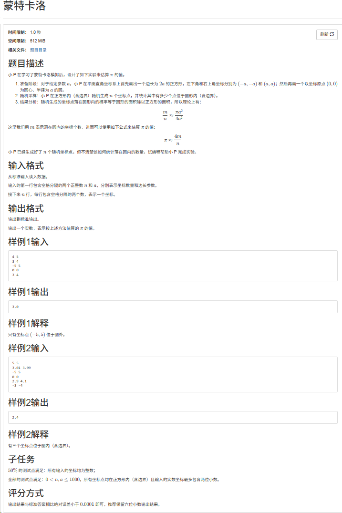

CSP 不到 120 不让毕业，正在备战 2026 年 12 月的考试。

:::collapse[39届CCF/CSP记录]

:::collapse[蒙特卡洛]


这道题简简单单的小模拟题，只需要掌握高中数学即可。

:::collapse[题目]
正方形 $[-a, a]^2$ 里有个半径 $a$ 的圆，给 $n$ 个点，数圆内（含边界）的点数 $m$，输出 $4m/n$。

- 输入：$n\ a$，后面 $n$ 行坐标
- 输出：一个实数，保留六位小数
- 范围：$n, a \le 1000$，坐标最多两位小数
  :::

:::collapse[思路]
圆的方程 $x^2 + y^2 = a^2$，圆心在原点，所以判据就是 $x^2 + y^2 \le a^2$。

正方形面积 $4a^2$，圆面积 $\pi a^2$，点在正方形里均匀撒，落在圆内的概率是 $\pi/4$。用 $m/n$ 近似它：

$$
\frac{m}{n} \approx \frac{\pi}{4} \quad\Longrightarrow\quad \pi \approx \frac{4m}{n}
$$

数一遍点就行，$O(n)$。
:::

:::collapse[代码]

```cpp
#include<bits/stdc++.h>
using namespace std;
//随机生成概率 最后计算 4m/n即可
int main() {

    int n, a, m = 0;
    cin >> n >> a;
    for(int i = 0; i < n; i++) {
        double x, y;
        cin >> x >> y;
        if((x * x) + (y * y) <= (a * a)){
            //cout << "current:" << x << "|" << y << endl;
            m++;
        }
    }
    double result = (4 * m) / n;
    printf("%.6f", result);
    return 0;
}
```

:::

:::collapse[踩的坑]
**1. 忘了圆的方程**

卡了半天，想不起来点在圆内怎么判。

就是 $x^2 + y^2 = a^2$，所以 $x^2 + y^2 \le a^2$ 在圆内。

**2. `4 * m / n` 是整数除法**

`m`、`n` 都是 `int`，`(4 * m) / n` 先截断再转 `double`。样例 1 的 $12/4$ 整除，看不出来；样例 2 的 $12/5$ 直接变成 2，输出 `2.000000`，答案是 2.4。

改成 `4.0 * m / n`。

**3. 含边界**

判据是 `<=` 不是 `<`。样例 2 的 $(-3,-4)$ 正好在圆上（$9+16=25$），漏掉它答案就变成 `1.6`。

:::

:::
:::

## 目标

| 项目 | 内容                   |
| ---- | ---------------------- |
| 考试 | CCF CSP，2026 年 12 月 |
| 目标 | 总分 ≥ 120             |

## 计划

- [ ] 每天两道大模拟题
- [ ] 刷历年真题，从里面找规律
- [ ] 每道题的思路和坑都记下来
